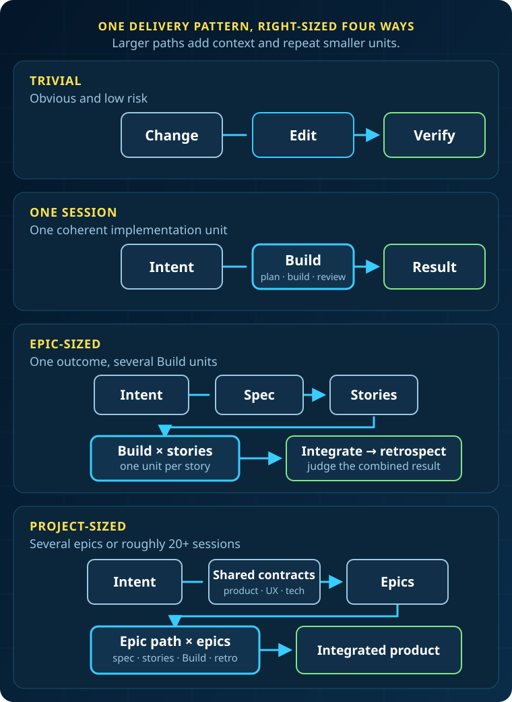

Use this guide to choose the smallest amount of BMad that safely fits your
software change.


Every path uses the same delivery loop. Larger work adds shared context around
the loop and repeats its implementation unit; it does not switch to a separate
delivery system.

## When to Use This

- Before starting a change when you are unsure how much planning it needs
- When one request has grown beyond a single implementation session
- When deciding which stories need your attention and which can run unattended
- When coordinating several epics without losing the shared product intent

:::note[Prerequisites]
Install BMad before using Build or another BMad workflow. You don't need BMad
for an obvious, low-risk edit.
:::

## Choose the Path

### 1. Find the Smallest Safe Unit

Start with the intent, not a preferred workflow. Ask whether one implementation
session can reasonably understand, implement, review, and finish the change.

Scope is only one signal. Use more planning when the work has high risk,
unclear requirements, broad architectural reach, cross-system effects, or
coordination between people or teams.

The session counts below are guidelines, not requirements. A small security
change may need more structure than a much larger routine update.

### 2. Choose a Path

| Path               | Use it when                                                                             | Start with                                         |
| ------------------ | --------------------------------------------------------------------------------------- | -------------------------------------------------- |
| Trivial work       | The edit is obvious, low-risk, and does not benefit from structured review              | Make the edit directly                             |
| One-session work   | One coherent intent fits an implementation session                                      | `bmad-build`                                       |
| Epic-sized work    | One coherent outcome needs several implementation sessions                              | `bmad-spec`, then Story Breakdown                  |
| Project-sized work | The work spans several epics or likely needs roughly 20 or more implementation sessions | The [full BMad flow](../reference/workflow-map.md) |



If a tiny change would benefit from explicit planning and review, use
`bmad-build` even though you could edit it directly.

## Run the Path

### 3. Start Trivial or One-Session Work

For trivial work, make the change with your normal development tools. Do not
add workflow steps that provide no useful safety or clarity.

For one-session work, invoke Build directly with the outcome you want:

```text
/bmad-build Add JSON output to the diffsettings command without changing its
existing formats.
```

Build accepts direct intent, an issue, an intent file, an existing Build spec,
or a planned story. It clarifies the unit, plans when needed, implements it,
reviews the result, and records what happened. See [Build](../explanation/build.md)
for the implementation model.

### 4. Start Epic-Sized Work

Use the lightweight epic path when the work needs several Build sessions but
still has one coherent outcome.

**Define and divide the epic**

1. Run `bmad-spec` with the epic intent.
2. Ask for Story Breakdown. This creates the ordered `stories.yaml` beside
   `SPEC.md`.
3. Review the proposed order and decide which stories need checkpoints.

The story list is an execution plan, not a promise that nothing will change.
Update the spec and re-run Story Breakdown when earlier work reveals a missing
constraint, a better division, or a conflict between stories.

**Establish the implementation pattern**

Implement important, risky, or foundational stories with `bmad-build`. Early
stories often settle the architecture, initial project structure, and repeated
patterns that later stories will follow. Give those decisions human attention
before automating repetitions of them.

Run Build once per story. Build creates or resumes that story's implementation
record under the spec folder and keeps it linked to the parent spec.

**Finish the epic**

Verify the stories together, not only one at a time. Then run
`bmad-retrospective` with the spec folder. Retrospective reads `stories.yaml`
as the epic inventory and judges the combined result against the parent spec.

### 5. Start Project-Sized Work

Use the full BMad flow for a greenfield product, a multi-epic initiative, or
work likely to need roughly 20 or more implementation sessions.

Prepare the planning that the project actually needs: discovery, product
requirements, UX, architecture, epics, readiness, and sprint planning. These
artifacts create shared contracts and coordination around implementation. They
do not replace Build. Each epic still becomes a sequence of session-sized units.

Independent epic streams can proceed in parallel when their dependencies and
integration boundaries are explicit. Each stream needs an owner, and all
streams remain accountable to the same product intent and architecture. Run
integration checks and a retrospective at each epic boundary.

## Operate Larger Paths

### 6. Add Automation After Decisions Stabilize

`bmad-build-auto` runs one session-sized unit without waiting for human input.
It does not choose the next story or own the backlog.

Use it after the important implementation decisions are stable. An AI coding
session can act as the orchestrator, dispatch one Build Auto worker per story,
and revise later work when new evidence appears. The optional
[bmad-loop](https://github.com/bmad-code-org/bmad-loop) orchestrator can run an
ordered `stories.yaml` deterministically.

bmad-loop follows list order. It does not infer a dependency graph or provide
project-level parallel coordination. For the worker contract, story selection,
and status records, see
[Autonomous Development Loops](../reference/build-auto.md).

### 7. Protect the Larger Intent

Dividing work can lose information. A requirement may weaken, a constraint may
disappear, or two correct stories may fail when combined. Larger BMad paths add
controls for those risks:

- Product, UX, architecture, and epic artifacts preserve shared decisions.
- Every implementation unit remains traceable to its parent contract.
- Story records carry implementation decisions and completion state forward.
- Later units can incorporate evidence from earlier work.
- Integration checks judge the combined behavior.
- New evidence can update later units or the parent plan.
- Retrospectives judge the whole epic and feed lessons into later work.

Planning therefore continues during implementation. The sequence of units can
evolve as long as changes are reconciled with the parent intent.

## What You Get

You get a development path sized to the work: direct editing for the safest
trivial changes, one attentive Build run for a session-sized unit, a shared spec
and story records for an epic, or full project contracts and coordination for
several epics.
